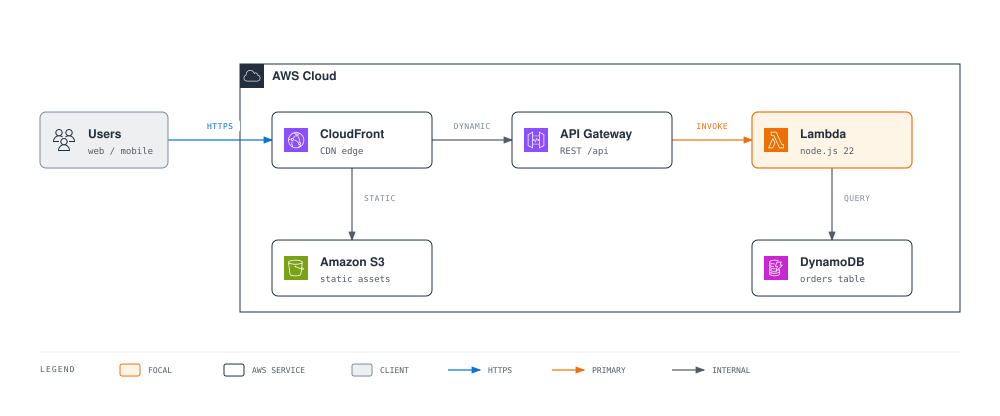
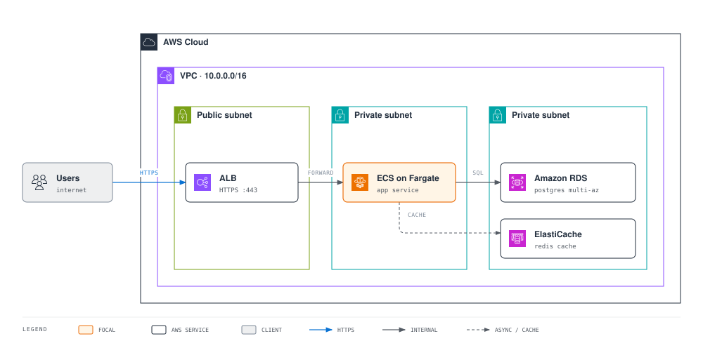
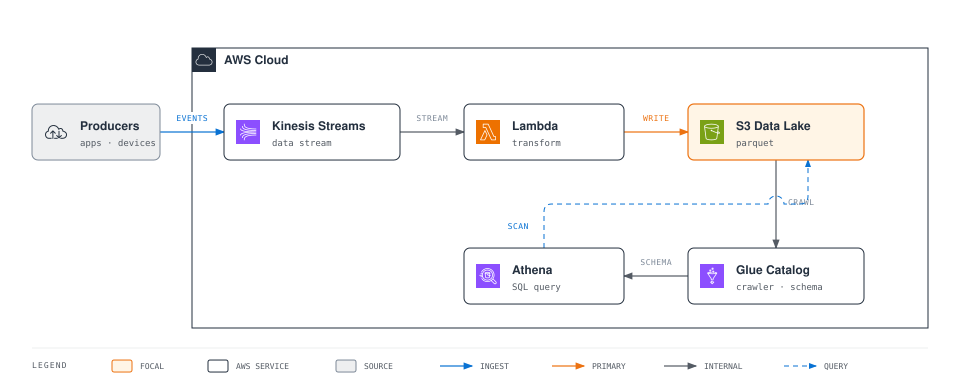
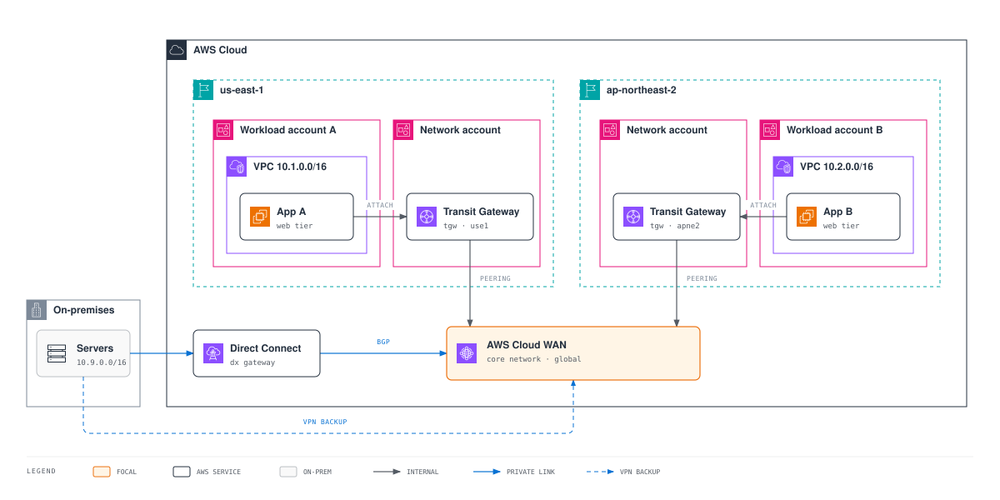
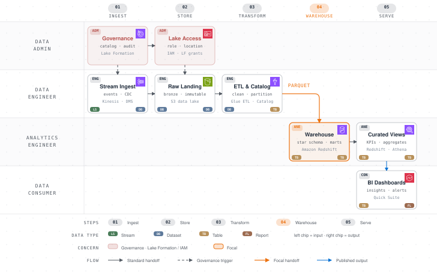

# AWS Diagram Design Skill(aws-diagram-design)

> [masangbeom/aws-diagram-design](https://github.com/masangbeom/aws-diagram-design) 1.2.0 을 [hi-aws-skills](https://github.com/hi-space/hi-aws-skills) 로 가져온 판입니다. 원본 위에 `skills/aws-diagram-design/scripts/pygen/` Python 생성기(ko/en PNG 일괄 생성)와 `references/python-generator.md` 를 더했습니다.

**한국어** | [English](README.en.md)

**말로 설명하면, AWS 다이어그램을 작성합니다.**

draw.io 등을 사용하여 다양한 아키텍처 및 다이어그램을 작성하는 대신, Claude Code나 Kiro에게 이렇게 말해보세요.

> "ALB 뒤에 Fargate 서비스 두고, RDS Multi-AZ랑 ElastiCache 붙는 VPC 3-티어 구성도 그려줘"

[공식 AWS Architecture Icons](https://aws.amazon.com/ko/architecture/icons/)와 Amazon Ember 타이포그래피, VPC/서브넷/계정 컨테이너 규약까지 적용된 다이어그램이 자체 완결형 HTML로 생성되고, 필요하면 SVG/PNG로 바로 내보낼 수 있습니다. 제안서, 위키, 발표 자료, 아키텍처 리뷰에 그대로 쓸 수 있는 품질을 목표로 합니다.

## 이런 걸 그려줍니다

- **아키텍처 구성도**: 서버리스, VPC 네트워크, 멀티 계정/멀티 리전, 하이브리드(Direct Connect/VPN)까지. VPC/서브넷/Region/계정 경계는 공식 그룹 컨테이너 색상/배지 규약을 따릅니다.
- **운영/설계 문서에 쓰는 나머지 전부**: 플로차트, 시퀀스, 상태 머신, ER, 타임라인, 스윔레인, 간트, 조직도, 레이어 스택, 데이터 플로 등 총 27개 시각 타입.
- **기존 다이어그램 재작도**: 갖고 있는 draw.io(.drawio)나 Mermaid(.mmd) 파일을 읽어 내용은 유지한 채 지정한 크기와 상세도(문서용/슬라이드용/요약본)로 다시 그립니다.

AWS 서비스를 명명하는 노드에는 다이어그램 타입에 관계없이 공식 아이콘이 들어가고, 강조는 smile orange 포컬 1–2개로 절제하는 에디토리얼 디자인 시스템([cathrynlavery/diagram-design](https://github.com/cathrynlavery/diagram-design) 기반)이 적용됩니다.

## 미리보기

아래는 모두 이 스킬로 생성한 결과물입니다. 원본 HTML은 [docs/samples/](docs/samples/)에 있습니다.

### Serverless Web Application

가장 흔한 시작점. CloudFront가 S3 정적 자산과 API Gateway → Lambda → DynamoDB 동적 경로를 분기합니다. ([HTML](docs/samples/serverless-web-app.html))



### VPC Three-Tier Web Service

퍼블릭 서브넷의 ALB → 프라이빗 서브넷의 ECS on Fargate → 데이터 서브넷의 RDS/ElastiCache. 서브넷 경계 색상과 배지가 공식 규약 그대로입니다. ([HTML](docs/samples/vpc-three-tier.html))



### Event-Driven Data Pipeline

Kinesis → Lambda → S3 데이터 레이크 스트리밍 수집과, Glue 카탈로그를 거쳐 Athena가 S3를 직접 스캔하는 분석 경로. 교차하는 커넥터는 bridge/hop으로 처리됩니다. ([HTML](docs/samples/event-driven-pipeline.html))



### Multi-Region Network Backbone

멀티 계정/멀티 리전 네트워크의 전형적인 모양. 리전별 Network account의 Transit Gateway가 AWS Cloud WAN 코어로 피어링되고, 온프레미스는 Direct Connect(BGP) + Site-to-Site VPN 백업으로 연결됩니다. ([HTML](docs/samples/multi-region-network.html))



### AWS Data Pipeline Flow

"누가 어느 단계에서 무엇을 하는가"를 보여주는 역할 스코프 데이터 플로. Data Admin이 Lake Formation 카탈로그 거버넌스와 IAM 접근 권한을 점선 트리거로 내려주고, 그 아래에서 Kinesis/DMS 수집 → S3 레이크 → Glue ETL → Redshift DW(포컬 핸드오프) → Quick Suite 대시보드로 이어집니다. 각 노드의 공식 서비스 아이콘과 하단 칩이 페이로드 타입 변환(스트림→데이터셋→테이블→리포트)을 추적합니다. ([HTML](docs/samples/data-pipeline-flow.html))



> GitHub은 이미지 렌더링 시 외부 폰트를 차단하므로 위 SVG는 시스템 폰트로 보입니다. Amazon Ember 폰트 그대로 보려면 HTML 원본을 브라우저에서 여세요.

## 시작하기

### Claude Code

```
/plugin marketplace add hi-space/hi-aws-skills
```
```
/plugin install aws-diagram-design@hi-aws-skills
```
```
/reload-plugins
```

로컬에 클론해 뒀다면 경로로 등록해도 됩니다: `/plugin marketplace add /path/to/hi-aws-skills`.

### Kiro (IDE / CLI)

```bash
./install.sh kiro            # ~/.kiro/skills/ 에 복사 (--workspace: 프로젝트 로컬, --link: 심링크)
```

Kiro는 Anthropic 형식 Agent Skills를 그대로 읽으므로 별도 변환이 없습니다. Power로 등록하는 방법은 [docs/guide-kiro.md](docs/guide-kiro.md) 참고.

### 폰트 (선택)

```bash
./install.sh fonts           # 번들된 Amazon Ember TTF를 OS 폰트 디렉터리에 설치
```

Amazon Ember는 [Amazon 공식 배포본](https://developer.amazon.com/en-US/alexa/branding/echo-guidelines/identity-guidelines/typography)을 스킬에 번들해 두었습니다(`skills/aws-diagram-design/assets/fonts/`). 생성되는 다이어그램은 로컬 설치본 → 번들 woff2 → Helvetica 순으로 폰트를 찾으므로, 설치하지 않아도 동작에는 문제가 없습니다.

## 이렇게 써보세요

평소 쓰는 말로 요청하면 됩니다. 한국어 트리거(구성도, 아키텍처 다이어그램, 흐름도, 시퀀스 다이어그램 등)를 인식합니다.

```
"이 프로젝트 아키텍처 구성도 그려줘. EKS에 ArgoCD 배포, RDS는 Multi-AZ"
"Transit Gateway 허브-스포크 네트워크 구성도, 계정 3개짜리로"
"AWS 주문 처리 시퀀스 다이어그램 그려줘 — API Gateway, Lambda, SQS, DynamoDB"
"이 온보딩 프로세스를 스윔레인으로 정리해줘"
```

기존 파일 재작도와 내보내기는 슬래시 커맨드로:

```
/aws-diagram-design:import-drawio legacy-arch.drawio     # draw.io 파일을 다시 그리기
/aws-diagram-design:import-mermaid pipeline.mmd          # Mermaid 파일을 다시 그리기
/aws-diagram-design:export-diagram my-diagram.html       # 생성된 HTML을 SVG/PNG로 내보내기
```

재작도 시 크기(문서 인라인/와이드/슬라이드 16:9/소셜 카드), 상세도(faithful/balanced/simplified), 독자(엔지니어/혼합/경영진)를 지정할 수 있고, 병합되거나 생략된 요소는 fidelity ledger로 보고됩니다.

## 문서용 다이어그램 세트를 코드로 생성하기

워크숍 가이드나 문서 사이트처럼 다이어그램이 수십 장 필요하고 한국어·영어 판을 같은 레이아웃으로 유지해야 하면, SVG를 손으로 쓰는 대신 `scripts/pygen` 생성기를 씁니다. 스펙 파일은 좌표와 텍스트만 적고, 라이브러리가 스킨·아이콘·직교 커넥터·라벨 마스크·범례·접근성 태그를 규칙대로 그립니다.

```bash
SKILL=plugins/aws-diagram-design/skills/aws-diagram-design
python3 $SKILL/scripts/pygen/build.py docs/diagrams --out docs/diagrams/out                 # spec_*.py → HTML (ko/en)
python3 $SKILL/scripts/pygen/export.py docs/diagrams/out --png-dir static/images/diagrams   # PNG @2x
```

스펙 작성법과 API, 텍스트 예산(이름 1줄 + 부제 1줄, 16px/12px), 흔한 실수는 [`references/python-generator.md`](skills/aws-diagram-design/references/python-generator.md) 에, 동작하는 예시는 [`scripts/pygen/spec_example.py`](skills/aws-diagram-design/scripts/pygen/spec_example.py) 에 있습니다.

## AWS 공식 리소스를 그대로 씁니다

| 리소스 | 내용 |
|---|---|
| [AWS Architecture Icons](https://aws.amazon.com/ko/architecture/icons/) | 공식 아이콘 패키지(릴리스 07312026) 812종 번들: 서비스 305, 리소스 466, 그룹 15, 카테고리 26. 변형/재채색 없이 원본 그대로 사용하며, 아키텍처 외 모든 다이어그램 타입에도 적용됩니다. 갤러리: `assets/aws-icons.html` |
| 그룹 컨테이너 규약 | AWS Cloud, 계정, Region, VPC, 퍼블릭/프라이빗 서브넷, 보안 그룹 등의 공식 경계 색상/배지/점선 규칙 |
| [Amazon Ember](https://developer.amazon.com/en-US/alexa/branding/echo-guidelines/identity-guidelines/typography) | 공식 배포 폰트 번들(woff2 + TTF). squid ink `#232F3E` + smile orange `#EC7211`/`#FF9900` 팔레트와 함께 AWS 브랜드 스킨을 구성 |

## 저장소 구조

```
aws-diagram-design/
├── .claude-plugin/                 # Claude Code 플러그인 매니페스트 + 마켓플레이스 카탈로그
├── plugin.json                     # Agent Plugins 매니페스트 (Kiro Power용)
├── commands/                       # 슬래시 커맨드 3종 (import-drawio / import-mermaid / export-diagram)
├── skills/aws-diagram-design/      # 정본 스킬 (모든 환경 공용)
│   ├── SKILL.md                    #   설계 시스템 + 27개 타입 라우팅
│   ├── references/                 #   타입별 스펙 40개 (style-guide, type-*, primitive-aws-icons 등)
│   ├── assets/                     #   템플릿·예제, aws-icons/ 812 SVG, fonts/ Amazon Ember
│   └── scripts/                    #   자체 검증(self_check, verify-geometry), drawio/mermaid 추출기
│       └── pygen/                  #   Python 생성기: awsdiag.py(라이브러리) · build.py · export.py · spec_example.py
├── scripts/                        # 저장소 수준 검증 스크립트 + 테스트 fixtures
├── docs/                           # 환경별 한글 가이드 + samples/ 예제 다이어그램
└── install.sh                      # claude-code · kiro · fonts 설치
```

## 라이선스

MIT. 서드파티 고지는 [THIRD_PARTY_LICENSES.md](THIRD_PARTY_LICENSES.md) 참고. AWS Architecture Icons는 [AWS 아이콘 이용 약관](https://aws.amazon.com/ko/architecture/icons/)을 따르며 변형/재채색이 금지되고, Amazon Ember는 동봉된 라이선스 가이드라인을 따릅니다.
