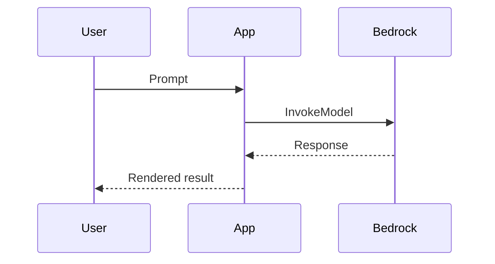

# Diagram recipes — stage 4

Diagrams carry the explanation so the prose can stay short. Three kinds, each with a default tool. Architecture and flow diagrams that show AWS services **must** use official AWS icons — never improvised shapes (non-negotiable rule in SKILL.md).

**Visuals are mandatory, not optional (INV-8).** The default question is not "would a visual help here?" but "which visual does this need?" — and the answer follows one rule:

- Someone needs to see a **setup/config screen or an example result screen** → a `<Screenshot>` capture slot (never AI-generated).
- Someone needs to see a **flow, an order of steps, or the whole picture** → a diagram: **`aws-diagram-design` / `aws-drawio-diagram`** for architecture (official AWS icons), **mermaid** for flows/sequences/decisions, **excalidraw** for a rough concept.
- Someone needs to see the **workshop's own scene→feature chain** → the `<FlowMap>` component.

Every scene page must contain at least one of these (GATE-4d), and the overview page must carry the whole-workshop architecture diagram (GATE-4e); a wall of text explaining a flow or a screen is a defect, not a style choice.

Every diagram the blueprint (stage 3) lists must be produced in stage 4 and counted (INV-5: requested diagrams == produced diagrams).

## 1. Mermaid — inline flows, sequences, decisions

Best for scene logic, request/response sequences, and decision trees. Renders natively in VitePress; no assets to manage. Prefer this when the diagram is about *flow*, not about *which AWS services*.

````md

````

Keep it to one idea per diagram. If a mermaid graph needs more than ~10 nodes, split it or move to an architecture diagram.

## 2. Architecture diagrams — `aws-diagram-design` (official AWS icons)

Best for "how the pieces connect" — services, VPCs, data stores, trust boundaries. Architecture diagrams are drawn with the hi-aws-skills diagram skills, not by hand:

| Need | Skill | Output |
|---|---|---|
| A finished picture for a page (default) | **`aws-diagram-design`** (`/aws-diagram-design`) | PNG/SVG with official AWS Architecture Icons and the Amazon Ember skin; `scripts/pygen` produces ko/en sets from one layout |
| An editable source the customer or SA will keep changing | **`aws-drawio-diagram`** | `.drawio` with verified stencils; render it to PNG for the page via `/aws-diagram-design:import-drawio` |
| Neither skill installed | drawio AWS4 shape library by hand | `.drawio` → PNG/SVG export; test that every `resIcon` renders |

Invoke the skill with the service list and the flow from `03a-architecture-rationale.md` §2; ask for a left-to-right reading order that matches the overview prose, and for labels in the workshop's default language (locale copies via pygen where the skill supports it).

**Mandatory architecture diagrams (INV-9, GATE-3e/4e):**

1. **Workshop overview architecture** — every service the workshop exercises, once. Lands at `docs/public/images/diagrams/overview-architecture.png` and is referenced from `start/overview.md` under the `<!-- arch:diagram -->` marker.
2. **One per scenario** — the slice of the architecture that scenario uses, referenced from `scenario-{x}/index.md`.
3. Per-scene architecture diagrams only where the blueprint's visual column says `drawio`; a scene that is about *flow* gets mermaid instead.

Workflow:
1. Generate with the skill → file under `docs/public/images/diagrams/`.
2. Reference it as a normal image, or as a `<Screenshot>` slot if the export is pending:
   ```md
   <Screenshot src="/images/diagrams/arch-scenario-a.png" alt="Scenario A architecture" caption="Data flow across the scenario" />
   ```
3. Record the diagram in the image manifest so an unfinished export is tracked (`scripts/image-manifest.mjs`).
4. Check that every service named in the overview's services table appears in the overview diagram, and vice versa (INV-5).

Official AWS icons only, unmodified and unrecoloured (AWS icon terms). Never improvise service glyphs.

## 3. Excalidraw — hand-drawn conceptual sketches

Best for a loose "mental model" sketch (a concept, an analogy, a before/after) where a precise architecture would be overkill. Export to SVG/PNG into `docs/public/images/diagrams/` and reference like any image. Not for AWS-service topology — use drawio for that.

## Choosing

| You want to show… | Use |
|---|---|
| A sequence of calls / a decision path / a scene's steps | Mermaid |
| Which AWS services connect, trust boundaries, data stores | `aws-diagram-design` (PNG/SVG) or `aws-drawio-diagram` (editable) — official AWS icons |
| A concept, analogy, or rough before/after | Excalidraw |
| The scene → feature chain in the workshop itself | `<FlowMap>` component (not a diagram file) |

## Conceptual illustrations (Bedrock / Stable Diffusion)

Allowed only for **conceptual** illustration — a hero background, a section header, a persona avatar — and always labeled as an illustration. **Never** to depict a product screen or a real UI (that is what `<Screenshot>` capture slots are for). See GATE-4c and the non-negotiable rules in SKILL.md.

## Placement

- Diagram exports: `docs/public/images/diagrams/`
- Reference from Markdown with a path under `docs/public` (leading `/`).
- Unfinished exports go through `<Screenshot>` so the build still passes and the manifest tracks them.
